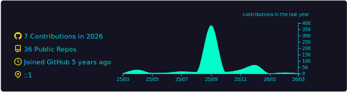

<!--START_SECTION:progress-->
⌛ Progress of 2025
<!--e454434e-d301-11f0-ae2b-6045bde8d138-->
⣿⣿⣿⣿⣿⣿⣿⣿⣿⣿⣿⣿⣿⣿⣿⣿⣿⣿⣿⣿⣿⣿⣿⣿⣿⣿⣿⣿⣿⣿⣿⣿⣿⣿⣿⣿⣿⣿⣿⣿⣿⣿⣿⣿⣿⣿⣦⣀⣀ 93.25%
<!--END_SECTION:progress-->

---

<!--<table>-->
<!--<tr>-->
<!--<td>-->
<!--<picture>-->
<!-- <source media="(prefers-color-scheme: dark)" srcset="assets/profile_summary_card_dark.svg">-->
<!-- <source media="(prefers-color-scheme: light)" srcset="assets/profile_summary_card.svg">-->
<!-- -->
<!--</picture>-->
<!--<picture>-->
<!-- <source media="(prefers-color-scheme: dark)" srcset="assets/readme_card_dark.svg">-->
<!-- <source media="(prefers-color-scheme: light)" srcset="assets/readme_card.svg">-->
<!-- -->
<!--</picture>-->
<!--<picture>-->
<!-- <source media="(prefers-color-scheme: dark)" srcset="assets/leet_card_dark.svg">-->
<!-- <source media="(prefers-color-scheme: light)" srcset="assets/leet_card.svg">-->
<!-- -->
<!--</picture>-->
<!--</td>-->
<!--<td>-->
<!--
-->
<!--
👋 Bio
-->
<!--<ul>-->
<!--<li>Gnu Believer. <a href="https://my.fsf.org/join">Support it now.</a></li>-->
<!--<li><a href="https://isc.tamu.edu/~lewing/linux/">Tux</a> Sheep(We suck Windows).</li>-->
<!--<li>Disciple of <a href="http://www.catb.org/~esr/faqs/smart-questions.html#rtfm">RTFM & STFW</a>. Ps. ATFL(Ask The Fucking LLM)</li>-->
<!--</ul>-->
<!--
-->
<!--
-->
<!--
✉️ Contact me
-->
<!--<ul>-->
<!--<li>-->
<!--Email - -->
<!---->
<!--■■■■■■■-->
<!-- -->
<!--Please sign the email with-->
<!--<a href="https://gnupg.org/">GPG</a> as possible.-->
<!-- -->
<!--</li>-->
<!--<li>-->
<!--ESmi - -->
<!---->
<!--■■■■■■■-->
<!--+1-339-236-3169-->
<!---->
<!-- -->
<!--Feel free to leave voice messages.-->
<!--</li>-->
<!--<li>-->
<!--Matrix - -->
<!---->
<!--■■■■■■■-->
<!--@0x00.tor:matrix.org-->
<!---->
<!--</li>-->
<!--</ul>-->
<!--
-->
<!--
-->
<!--
📚 Ycombinator
-->
<!---->
<!--
-->
<!--</td>-->
<!--</tr>-->
<!--</table>-->

👋 <b>Bio</b>

- Gnu Believer. [Support it now](https://my.fsf.org/join).
- [Tux](https://isc.tamu.edu/~lewing/linux/) Sheep(We suck Windows).
- Disciple of [RTFM & STFW](http://www.catb.org/~esr/faqs/smart-questions.html#rtfm). Ps. ATFL(Ask The <!--Fucking--> LLM).

✉️ <b>Contact me</b>

<ul>
<li>Email - ■■■■■■■</li>
<!--0om3smzqe@mozmail.com-->
Please sign the email with <a href="https://www.ietf.org/rfc/rfc4880.txt">GPG</a> as possible.
<li>ESmi - ■■■■■■■</li>
<!--+1-339-236-3169-->
Feel free to leave voice messages.
<li>Matrix - ■■■■■■■</li>
<!--@0x00.tor:matrix.org-->
<!--disable now-->
</ul>

☕ <b>Buy me a coffe</b>

<ul>
<li>Ethereum - 0xaa743e3d34B9532F0Ec2A813777A3ef9aAc379AA</li>
</ul>

> [!NOTE]
>
> My relay mail GPG keyring is [69052C6E56CF9DD214C8562201BCD77D89BF8C77](https://keys.openpgp.org/search?q=69052C6E56CF9DD214C8562201BCD77D89BF8C77). Check the [sha1sum](69052C6E56CF9DD214C8562201BCD77D89BF8C77.sha1) Btw.
> 
> Or you can catch the "flag" in [steganography.jpg](steganography.jpg).

---

<picture>
<source media="(prefers-color-scheme: dark)" srcset="https://raw.githubusercontent.com/dhay3/dhay3/output/github-contribution-grid-snake-dark.svg">
<source media="(prefers-color-scheme: light)" srcset="https://raw.githubusercontent.com/dhay3/dhay3/output/github-contribution-grid-snake.svg">

</picture>

[//]: # (![]&#40;https://raw.githubusercontent.com/dhay3/dhay3/output/github-contribution-grid-snake.svg&#41;)